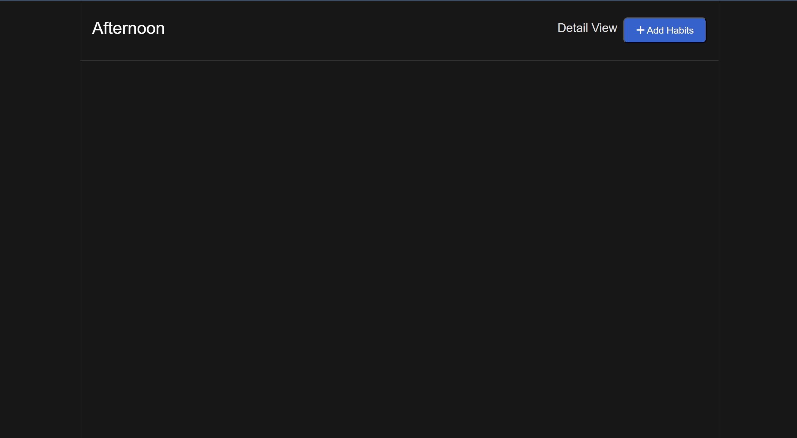
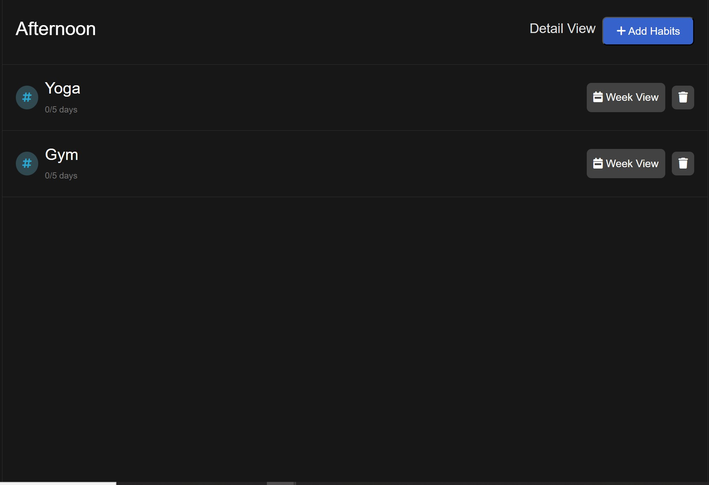

# Habbit_tracker
Habit Tracker is a web application that helps you keep track of your daily habits and goals. It provides a simple and intuitive interface for managing your habits, marking completion, and monitoring progress. With Habit Tracker, you can stay organized and motivated to achieve your desired habits and improve your daily routine.
## Features
* Add and manage your habits: Create a list of habits that you want to track and maintain.
* Track habit completion: Mark habits as completed each day to track your progress.
* Visualize your progress: View your habit completion history and track your overall progress over time.
* Set reminders: Receive reminders and notifications to help you stay consistent with your habits.
* Customize habit details: Add descriptions, set goals, and configure reminders for each habit.
* User-friendly interface: Enjoy a clean and intuitive interface that makes habit tracking a breeze.
## Installation
1. Clone the repository: 
*  git clone: https://github.com/Kshanaprava/habit-tracker.git
2. Navigate to the project directory:
*  cd habit-tracker
3. Install the dependencies:
*   npm install
4. npm install
*   npm start
5. Open your web browser and visit http://localhost:3000 to access the Habit Tracker app.
## Technologies Used
* Node.js
* Express.js
* MongoDB
* React
* Bootstrap
## Acknowledgements
* Font Awesome for providing awesome icons.
* Bootstrap for the responsive CSS framework.
## Sample Output

